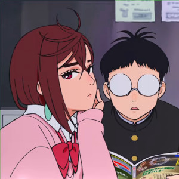
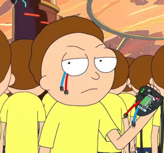
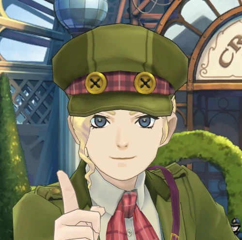
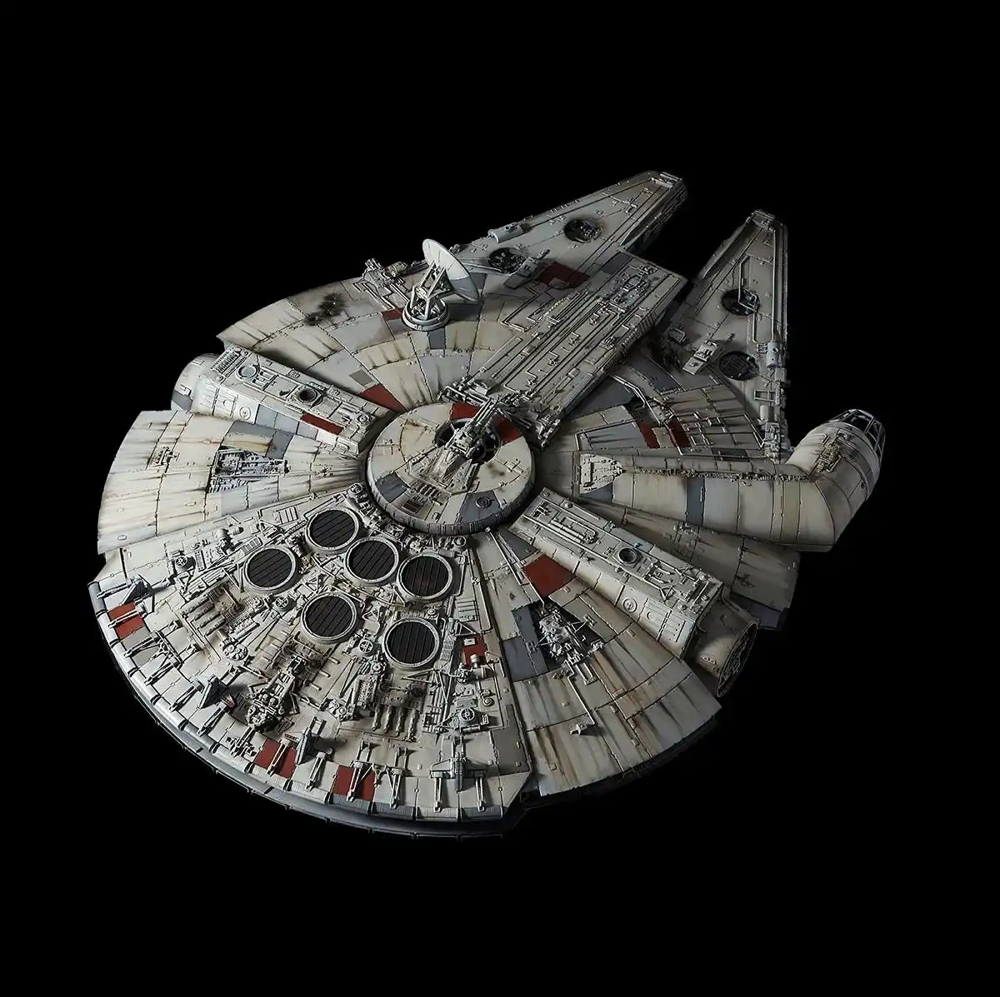
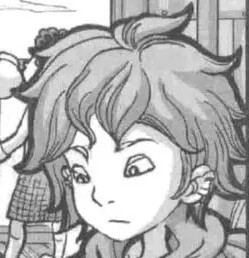
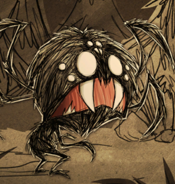
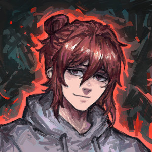



<link rel="stylesheet" href="/waifu/style.css">

  <!-- A -->
  

    

      
      <h2>阿比斯深渊</h2>
      
Abyss

      
《来自深渊》

      <a href="https://zh.moegirl.org.cn/来自深渊/阿比斯" target="_blank" rel="noopener noreferrer" class="wiki-btn">萌娘百科</a>
    

  

  

    

      
      <h2>阿尔泰尔</h2>
      
Altair

      
《Re:CREATORS》

      <a href="https://zh.moegirl.org.cn/阿尔泰尔(Re:CREATORS)" target="_blank" rel="noopener noreferrer" class="wiki-btn">萌娘百科</a>
    

  

  

    

      
      <h2>绫濑 桃</h2>
      
Ayase Momo

      
《胆大党》

      <a href="https://zh.moegirl.org.cn/绫濑桃" target="_blank" rel="noopener noreferrer" class="wiki-btn">萌娘百科</a>
    

  

  <!-- C -->
  

    

      
      <h2>伊巧巧</h2>
      
Choy

      
《美食大冒险》

      <a href="https://zh.moegirl.org.cn/美食大冒险系列" target="_blank" rel="noopener noreferrer" class="wiki-btn">萌娘百科</a>
    

  

  <!-- E -->
  

    

      
      <h2>邪恶莫蒂</h2>
      
Evil Morty

      
《瑞克和莫蒂》

      <a href="https://en.wikipedia.org/wiki/Evil_Morty" target="_blank" rel="noopener noreferrer" class="wiki-btn">维基百科</a>
    

  

  <!-- F -->
  

    

      
      <h2>“万花筒”</h2>
      
Kaleid Scoper

      
我的自设

      <a href="/about/" target="_blank" rel="noopener noreferrer" class="wiki-btn">关于</a>
    

  

  

    

      
      <h2>法里达</h2>
      
Fareeda

      
Bilibili 音乐 VUP

      <a href="https://space.bilibili.com/23263470" target="_blank" rel="noopener noreferrer" class="wiki-btn">Bilibili</a>
    

  

  

    

      
      <h2>芙莉莲</h2>
      
Frieren

      
《葬送的芙莉莲》

      <a href="https://mzh.moegirl.org.cn/芙莉莲" target="_blank" rel="noopener noreferrer" class="wiki-btn">萌娘百科</a>
    

  

  <!-- G -->
  

    

      
      <h2>吉娜 雷斯垂德</h2>
      
Gina Lestrade

      
《大逆转裁判》

      <a href="https://mzh.moegirl.org.cn/吉娜·雷斯垂德" target="_blank" rel="noopener noreferrer" class="wiki-btn">萌娘百科</a>
    

  

  

    

      
      <h2>五条 悟</h2>
      
Gojo Satoru

      
《咒术回战》

      <a href="https://zh.moegirl.org.cn/五条悟" target="_blank" rel="noopener noreferrer" class="wiki-btn">萌娘百科</a>
    

  

  <!-- H -->
  

    

      
      <h2>汉 索罗</h2>
      
Han Solo

      
《星球大战》

      <a href="https://zh.wikipedia.org/wiki/韓·蘇羅" target="_blank" rel="noopener noreferrer" class="wiki-btn">维基百科</a>
    

  

  <!-- K -->
  

    

      
      <h2>来栖 真希奈</h2>
      
Kurusu Makina

      
《银河特急》

      <a href="https://zh.wikipedia.org/wiki/銀河特快車_Milky☆Subway" target="_blank" rel="noopener noreferrer" class="wiki-btn">维基百科</a>
    

  

  <!-- M -->
  

    

      
      <h2>满穗</h2>
      
Mahn Swei

      
《饿殍：明末千里行》

      <a href="https://zh.moegirl.org.cn/满穗" target="_blank" rel="noopener noreferrer" class="wiki-btn">萌娘百科</a>
    

  

  

    

      
      <h2>千年隼号</h2>
      
Millennium Falcon

      
《星球大战》

      <a href="https://zh.wikipedia.org/wiki/千年隼号" target="_blank" rel="noopener noreferrer" class="wiki-btn">维基百科</a>
    

  

  <!-- P -->
  

    

      
      <h2>菠萝吹雪</h2>
      
Pineapplello

      
《果宝特攻》

      <a href="https://zh.moegirl.org.cn/菠萝吹雪" target="_blank" rel="noopener noreferrer" class="wiki-btn">萌娘百科</a>
    

  

  <!-- R -->
  

    

      
      <h2>瑞克 桑切斯</h2>
      
Rick Sanchez

      
《瑞克和莫蒂》

      <a href="https://zh.moegirl.org.cn/瑞克·桑切斯" target="_blank" rel="noopener noreferrer" class="wiki-btn">萌娘百科</a>
    

  

  <!-- S -->
  

    

      
      <h2>老大</h2>
      
Skipper

      
《马达加斯加的企鹅》

      <a href="https://zh.wikipedia.org/wiki/馬達加斯加的企鵝" target="_blank" rel="noopener noreferrer" class="wiki-btn">维基百科</a>
    

  

  

    

      
      <h2>星蝶</h2>
      
Star Butterfly

      
《星蝶公主》

      <a href="https://zh.moegirl.org.cn/星蝶" target="_blank" rel="noopener noreferrer" class="wiki-btn">萌娘百科</a>
    

  

  

    

      
      <h2>斯图威 格里芬</h2>
      
Stewie Griffin

      
《恶搞之家》

      <a href="https://zh.moegirl.org.cn/斯图威·格里芬" target="_blank" rel="noopener noreferrer" class="wiki-btn">萌娘百科</a>
    

  

  

    

      
      <h2>蒸盒号</h2>
      
Steamer

      
《美食大冒险》

      <a href="https://zh.moegirl.org.cn/美食大冒险系列" target="_blank" rel="noopener noreferrer" class="wiki-btn">萌娘百科</a>
    

  

  <!-- T -->
  

    

      
      <h2>高仓 健</h2>
      
Takakura Ken

      
《胆大党》

      <a href="https://zh.moegirl.org.cn/高仓健" target="_blank" rel="noopener noreferrer" class="wiki-btn">萌娘百科</a>
    

  

  

    

      
      <h2>唐晓翼</h2>
      
T'ang Hsiao-i

      
《查理九世》

      <a href="https://mzh.moegirl.org.cn/唐晓翼" target="_blank" rel="noopener noreferrer" class="wiki-btn">萌娘百科</a>
    

  

  <!-- V -->
  

    

      
      <h2>薇尔莉特 伊芙加登</h2>
      
Violet Evergarden

      
《紫罗兰永恒花园》

      <a href="https://mzh.moegirl.org.cn/薇尔莉特·伊芙加登" target="_blank" rel="noopener noreferrer" class="wiki-btn">萌娘百科</a>
    

  

  <!-- W -->

  

    

      
      <h2>韦伯</h2>
      
Webber

      
《饥荒》

      <a href="https://zh.moegirl.org.cn/韦伯" target="_blank" rel="noopener noreferrer" class="wiki-btn">萌娘百科</a>
    

  

  

    

      
      <h2>吴凌旎</h2>
      
Wu Ling-ni

      
老婆大人的 OC

      <a href="/about/" target="_blank" rel="noopener noreferrer" class="wiki-btn">关于</a>
    

  

  

    

      
      <h2>流浪者</h2>
      
Wanderer

      
《原神》

      <a href="https://zh.wikipedia.org/wiki/流浪者_(原神)#参考资料" target="_blank" rel="noopener noreferrer" class="wiki-btn">维基百科</a>
    

  

